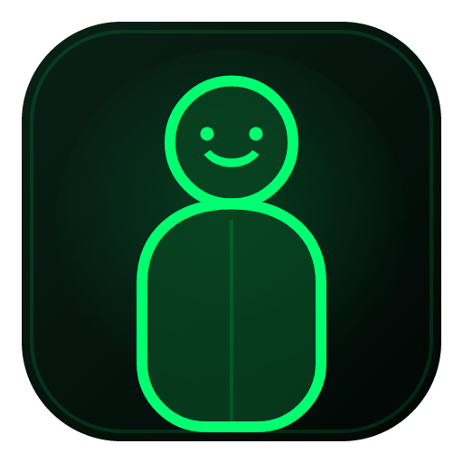
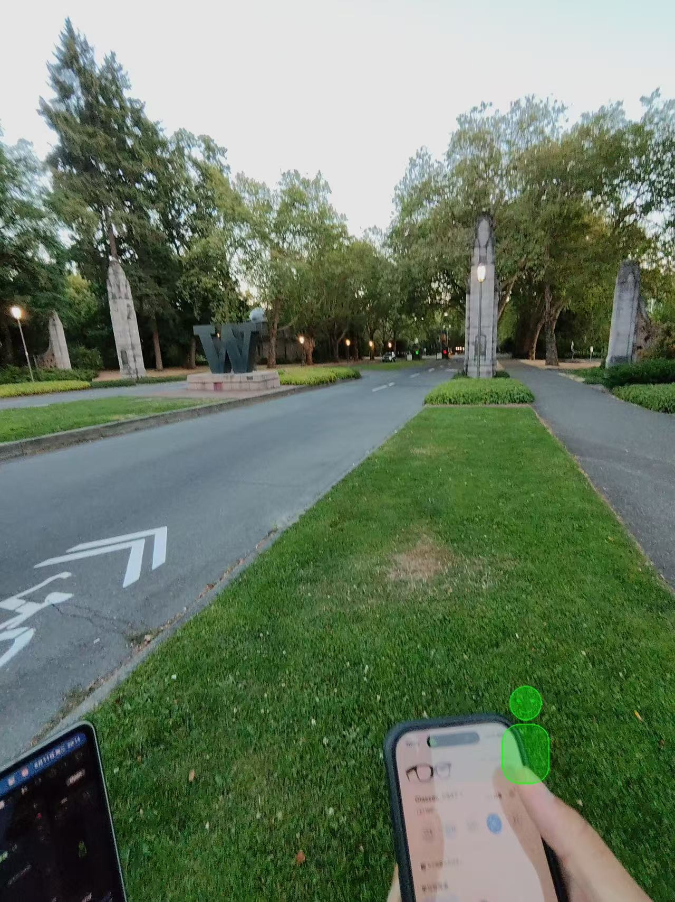

# 乐奇相片hud

<p align="center">
  
</p>

“乐奇相片hud”（代码名 LocketHUD）是在 Mac 上处理相片、并把最终画面显示到 Rokid 眼镜视野边缘的本地软件。当前主线由 Mac 0.1.4 编辑器和 AIUI 智能体“照片浮窗”1.0.0 组成；仓库同时保留原生 Android 显示端作为兼容/回退方案。

## 实际显示效果

<p align="center">
  
</p>

实拍图展示了绿色人物轮廓在眼镜视野右下角的效果。位置、大小、透明度和相片处理参数均由 Mac 软件调整，眼镜端负责最终显示。

Current conclusion: `AIUI_1.0_SUBMITTED_FOR_REVIEW`; `MAC_EDITOR_0.1.4_IMPLEMENTED`. The AIUI display path passed on the Rokid RG-glasses. Product control intentionally stays on the Mac: select/process a photo or GIF, preview it, adjust position/size/opacity, and send it over the existing local USB/ADB connection. Physical touchpad mapping is not on the active development path.

## Scope implemented

- Native Kotlin `Activity` and Canvas/Views; no Compose, Unity, database, service, WakeLock, or overlay.
- Black full-screen portrait mode with a generated transparent PNG.
- Six edge anchors, Small/Medium/Large sizes, and 40/60/80/100% opacity.
- Runtime-size and inset-aware layout with a central 50% protection zone.
- Persistent local configuration with schema version 1.
- Foreground-only `FLAG_KEEP_SCREEN_ON` behavior.
- First-back hide, second-back exit fallback; no unverified Rokid key code is bound.
- Debug-only minimal, calibration, input-probe, and validated Intent controls.
- Private PNG import from app-specific storage with size, format, and dimension validation.
- Animated GIF import, frame-by-frame green processing, Mac preview, transfer, playback, and relaunch persistence.
- Offline Pillow CLI for green conversion, gamma, contrast, sharpening, 8/16-level quantization, and Floyd-Steinberg dithering.
- Program-generated calibration and synthetic portrait assets only.
- Tauri 2 Mac editor with local image selection, green conversion, 8/16-level quantization, dithering, gamma, contrast, sharpening, layout preview, device detection, and one-click ADB delivery.
- 448×352 AIUI display client named “照片浮窗”; Mac dynamically creates a local AIX containing the current processed photo/GIF and settings.
- The last transferred AIX remains on the glasses, so reopening the agent restores the last screen without uploading the source photo to a cloud service.
- AIUI package requests no network, camera, speech, or microphone permission.

The Android fallback package name remains `dev.local.lockethud.poc`; it is not the primary AIUI package.

The Mac application displays `乐奇相片hud`; the AIUI agent displays `照片浮窗`. Their icons use the same green outlined smiling figure; the Mac icon has a transparent exterior outside its rounded square.

## Download 0.1.4

The public release contains the Mac application, AIUI package, fallback Android APK, review icon, and checksums: [乐奇相片hud / 照片浮窗 0.1.4](https://github.com/Wenshuishi0528/LocketHUD/releases/tag/v0.1.4).

- `LocketHUD-0.1.4-arm64.dmg`: Apple Silicon Mac application; the installed name is “乐奇相片hud”.
- `PhotoFloatingWindow-AIUI-1.0.0.aix`: AIUI glasses package; the intelligent-agent name is “照片浮窗”.
- `PhotoFloatingWindow-icon-512.png`: simple 512×512 AIUI review icon.
- `LocketHUD-Glasses-0.1.4-debug.apk`: native Android fallback build.
- `SHA256SUMS-0.1.4.txt`: SHA-256 checksums for all release binaries.

No private source portrait selected in the application is stored in this repository or its releases. AIUI previews and defaults use only the program-generated green figure. The two product-introduction images above are published with the author's permission.

## Build

```sh
./gradlew clean assembleDebug lintDebug testDebugUnitTest
python3 -m unittest discover -s tools/tests -v
```

The build uses Android Studio's bundled JBR because the Mac's default Java 11 is too old for Gradle 9.6/AGP 9.2.

Build the Mac editor:

```sh
cd mac-editor
npm install
npm run build
cargo test --manifest-path src-tauri/Cargo.toml
npm run tauri build
```

Build and verify the AIUI package:

```sh
cd aiui-app
npm install
npm run check
npm run pack:aix
npm run verify:aix
```

## Install and launch

```sh
adb devices -l
adb install -r glasses-app/build/outputs/apk/debug/glasses-app-debug.apk
adb shell am start -n dev.local.lockethud.poc/.MainActivity
```

Debug modes and configuration examples:

```sh
adb shell am start -n dev.local.lockethud.poc/.MainActivity --es mode minimal
adb shell am start -n dev.local.lockethud.poc/.MainActivity --es mode calibration
adb shell am start -n dev.local.lockethud.poc/.MainActivity \
  --es mode portrait --es anchor right_middle --es size small \
  --es opacity 0.6 --es keep_screen_on true --es visible true
adb shell am start -n dev.local.lockethud.poc/.InputProbeActivity
adb logcat -s LocketHUD.Input:I LocketHUD.Main:I LocketHUD.Asset:I '*:S'
```

Allowed anchors are `left_top`, `left_middle`, `left_bottom`, `right_top`, `right_middle`, and `right_bottom`. Allowed sizes are `small`, `medium`, and `large`; allowed opacity values are `0.4`, `0.6`, `0.8`, and `1.0`. Unknown values are ignored.

## Prepare and install a private portrait

Private files belong under ignored `local_assets/`; never add a personal image to `res/` or Git.

```sh
python3 tools/prepare_portrait.py \
  --input local_assets/portrait.png \
  --output-dir local_assets/processed \
  --max-width 120 \
  --profiles natural-green,quantized-8,quantized-16,dithered

cp local_assets/processed/portrait_quantized-16.png local_assets/processed/current.png
tools/install_private_portrait.sh local_assets/processed/current.png
```

The processor does not modify the source, does not connect to a network, preserves alpha, and writes PNGs without copying EXIF metadata. The import script writes only to this debug application's app-specific directory.

## License

© 2026 [wenshuishi0528](https://github.com/Wenshuishi0528). This project is licensed under the [Creative Commons Attribution 4.0 International License](LICENSE) (`CC BY 4.0`). Reuse must provide appropriate attribution, a link to the license, and indicate whether changes were made. Third-party dependencies retain their own licenses.

## Evidence and next action

- [Environment report](docs/ENVIRONMENT_REPORT.md)
- [Hardware report](docs/HARDWARE_REPORT.md)
- [SDK source map](docs/SDK_SOURCE_MAP.md)
- [Input map](docs/INPUT_MAP.md)
- [Build and install](docs/BUILD_AND_INSTALL.md)
- [Test protocol](docs/TEST_PROTOCOL.md)
- [Test results](docs/TEST_RESULTS.md)
- [Decision log](docs/DECISION_LOG.md)
- [Mac editor](docs/MAC_EDITOR.md)
- [Changelog](CHANGELOG.md)
- [Development handoff](HANDOFF.md)

Open the Mac editor, connect the glasses by USB, select a photo or GIF, adjust it in the 448×352 AIUI preview, and press “发送到眼镜”. ADB is the V1 development transport; a consumer transport is deliberately deferred. The official AIUI Studio project has been submitted and remains publicly unavailable until Rokid approves it.
